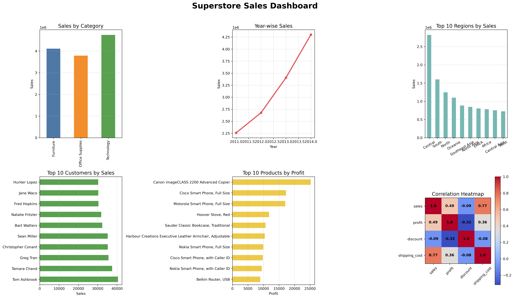
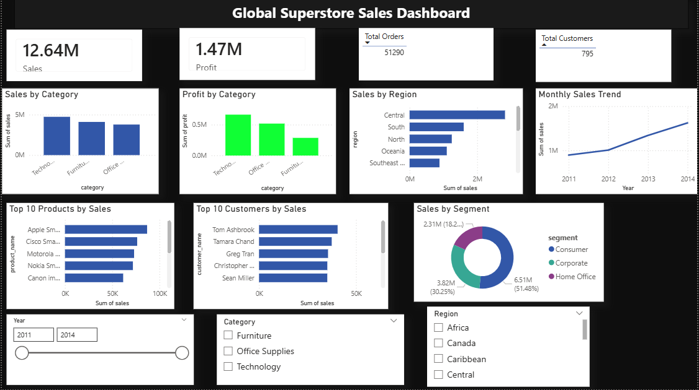

# 📊 Global Superstore Sales Analysis

## 📌 Project Overview

The **Global Superstore Sales Analysis** project is an end-to-end Data Analytics project that analyzes over **51,000 retail sales records** using **Python, MySQL (SQL), and Power BI**. The project demonstrates the complete analytics workflow, including data cleaning, exploratory data analysis (EDA), SQL-based business analysis, interactive dashboard development, and business insight generation to support data-driven decision-making.

---

## 🚀 Objectives

* Analyze retail sales performance.
* Clean and preprocess real-world business data.
* Perform SQL-based business analysis.
* Create meaningful visualizations using Python.
* Build an interactive Power BI dashboard.
* Generate actionable business insights.

---

## 🛠️ Technologies Used

* Python
* Pandas
* NumPy
* Matplotlib
* Seaborn
* MySQL
* SQL
* Power BI
* Jupyter Notebook
* Git & GitHub

---

## 📂 Project Structure

```text
Global-Superstore-Sales-Analysis/
│
├── Dataset/
│   ├── Global_Superstore.csv
│   └── Global_Superstore_Clean.csv
│
├── SQL/
│   └── Superstore_SQL_Practice.sql
│
├── Python/
│   ├── Superstore_Analysis.ipynb
│   └── dashboard.png
│
├── PowerBI/
│   ├── Global_Superstore_Sales_Dashboard.pbix
│   └── Dashboard.png
│
└── README.md
```

---

# 🐍 Python Analysis

The Python module includes:

* Data Cleaning
* Data Preprocessing
* Exploratory Data Analysis (EDA)
* Data Visualization
* Sales Analysis
* Profit Analysis
* Business Insights
* Dashboard Creation using Matplotlib

### Dashboard Preview 
Python/Sales_Dashboard.png

---

## 🗄️ SQL Analysis

SQL was used to perform business analysis and answer real-world business questions.

### SQL Topics Covered

* Database Creation
* Table Creation
* Data Cleaning
* SELECT Statements
* WHERE Clause
* ORDER BY
* GROUP BY
* HAVING
* Aggregate Functions
* Aliases
* IN / NOT IN
* BETWEEN
* CASE Statements
* String Functions
* Date Functions
* Subqueries
* Window Functions
* Views
* INNER JOIN
* LEFT JOIN
* RIGHT JOIN
* FULL OUTER JOIN (Simulation)

📄 SQL File

```text
SQL/Superstore_SQL_Practice.sql
```

---

# 📊 Power BI Dashboard

An interactive Power BI dashboard was developed to analyze retail sales performance and business trends.

### Dashboard Features

* 💰 Total Sales KPI
* 💵 Total Profit KPI
* 📦 Total Orders
* 👥 Total Customers
* 📊 Sales by Category
* 💵 Profit by Category
* 🌍 Sales by Region
* 📈 Monthly Sales Trend
* 🏆 Top 10 Products
* 👤 Top 10 Customers
* 🍩 Sales by Segment
* 🎛 Interactive Filters (Year, Category, Region)
* 
### Dashboard Preview


PowerBI/Dashboard.png

---

## 💡 Key Business Insights

The project identified several important business insights:

* Technology generated the highest overall sales.
* Technology produced the highest overall profit.
* The Central region recorded the highest sales.
* Consumer segment contributed the largest share of sales.
* Sales showed consistent growth from **2011–2014**.
* Top-performing products contributed significantly to total revenue.
* Interactive filters enable dynamic analysis by Year, Category, and Region.

---

## 📌 Project Workflow

```text
Raw Dataset (CSV)
        │
        ▼
Data Cleaning
(Python & SQL)
        │
        ▼
Exploratory Data Analysis
(Python)
        │
        ▼
Business Analysis
(MySQL)
        │
        ▼
Interactive Dashboard
(Power BI)
        │
        ▼
Business Insights
```

---

## 🎯 Skills Demonstrated

* Data Cleaning
* Data Preprocessing
* Exploratory Data Analysis (EDA)
* SQL Query Writing
* Business Intelligence
* Dashboard Development
* Data Visualization
* Business Insight Generation
* Power BI Reporting
* Git & GitHub

---

